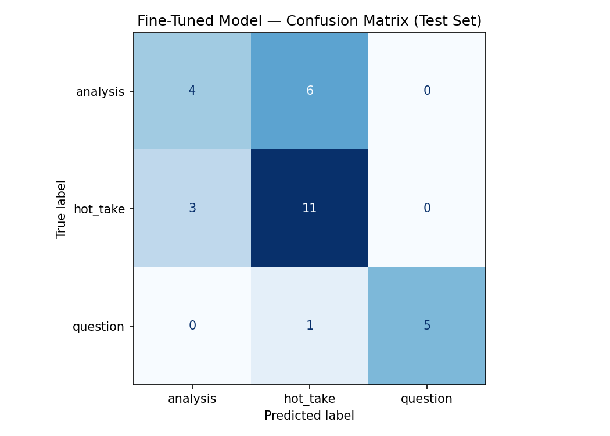

# TakeMeter

A fine-tuned text classifier that scores discourse quality in r/soccer posts.
Built for CodePath AI201 Project 3.

## Demo Video

[Watch the demo video on Google Drive](https://drive.google.com/file/d/1mZz0D2oDhMRXxVn_uTUlANYayAk6fHpI/view?usp=sharing)

---

## Community

**r/soccer** — the largest English-language soccer discussion community on Reddit,
with over 4 million members. It is active every day and especially during World Cup 2026.

This community is a good fit for classification because its discourse varies enormously.
In a single thread you can find detailed tactical arguments, emotional fan reactions,
and genuine questions — often within three replies of each other. The difference between
explaining *why* something happened versus just asserting it is something r/soccer
readers notice and value.

---

## Label Taxonomy

Three labels capture the main types of discourse in r/soccer:

| Label | Definition |
|---|---|
| `analysis` | The post makes a claim AND supports it with at least one specific reason, statistic, historical comparison, or tactical observation. The reasoning could stand on its own even without the opinion framing. |
| `hot_take` | A bold or confident opinion, reaction, or prediction stated without supporting reasoning. The post asserts rather than argues. |
| `question` | The post's primary purpose is to ask for information, clarification, or opinions from other users. A genuine question seeking an answer. |

**Example posts:**

`analysis`:
> "The Bielsa cycle is truly inevitable. He can be great if rigid tactically but at a certain point players stop responding to him. It also doesn't help that his style is so taxing physically."

> "I can't see Spain winning this world cup. Their defense is too leaky. Peru had 2-3 good chances to score and Peru is one of the weakest South American teams."

`hot_take`:
> "Belgium was really handed the easiest group with crappiest teams and the easiest route to the QF but decided to eat crayons instead."

> "Muslera should not play a single minute of football after this match, for club or country. The whole country knows he's finished except Bielsa."

`question`:
> "Is Unai Simon starting GK for the World Cup?"

> "Can anyone explain how Turkish clubs can offer such massive wages to players?"

**Hard edge case — bold opinion + one sentence of reasoning:**

> "I get that it's because most people don't watch their games but it's still mad that they treat this as a massive upset, Uruguay is horrendous and Cape Verde are clearly not that bad."

Decision rule: if the supporting sentence is a specific verifiable fact or logical chain
that could stand alone, label it `analysis`. If the support just restates the opinion
in different words or is too thin to stand on its own, label it `hot_take`.
The example above → `hot_take` (the reasoning is vague, not specific).

---

## Data Collection

**Source:** r/soccer Daily Discussion threads and Match Threads during World Cup 2026
(June 6–21, 2026). All posts are public. Data was collected manually from five threads:
the June 21 Daily Discussion, and match threads for England vs New Zealand,
Argentina vs Honduras, Peru vs Spain, and United States vs Germany.

**Labeling process:** Each comment was read individually and assigned one label using
the definitions above. The hard edge case decision rule (see above) was applied
consistently throughout annotation.

**Label distribution:**

| Label | Count | % |
|---|---|---|
| `hot_take` | 92 | 46% |
| `analysis` | 68 | 34% |
| `question` | 40 | 20% |
| **Total** | **200** | |

No single label exceeds 70%. The `hot_take` dominance is expected — r/soccer posts
more reactions and opinions than structured arguments or genuine questions.

**Three difficult examples and decisions:**

1. *"This World Cup is a signal for me to reset my presumptions about many footballing
countries because many of them are not what they're known for 10 and 20 years ago.
Germany's pressing is meh, Brazil's technique is just standard..."*
→ **hot_take**. Starts like analysis but the observations have no supporting data —
just personal impressions. Nothing specific or verifiable.

2. *"Booing the commercial breaks needs to be normalized. I think England did it first
during their game? Either way, good."*
→ **hot_take**. States a strong opinion. The factual claim ("England did it first")
is uncertain ("I think") — not confident enough to count as reasoning.

3. *"No Pedri no Party. Same thing happened when they almost fumbled the game in that
5-4 game against France. Score is 4-1, Pedri subbed out and they score 3 more."*
→ **analysis**. Cites a specific match result and scoreline as evidence. The reasoning
stands on its own even without the "No Pedri no Party" framing.

---

## Fine-Tuning Approach

**Base model:** `distilbert-base-uncased` (HuggingFace)

**Training platform:** Google Colab (free T4 GPU)

**Training setup:**
- Train / validation / test split: 70% / 15% / 15% (stratified, random_state=42)
- Train set: 140 examples — Validation: 30 — Test: 30

**Hyperparameter decision:**

Final settings: **7 epochs, learning rate 5e-5, batch size 16**.

The notebook default (3 epochs, 2e-5) was tried first. After 3 epochs the validation
accuracy was stuck at 46.7% — the model predicted `hot_take` for everything. With only
~9 gradient steps per epoch, 3 epochs gives just 27 total updates, which is not enough
for DistilBERT to break out of predicting the majority class on a small imbalanced dataset.

Switching to 7 epochs and a higher learning rate (5e-5) gave the model a stronger
signal and more time to learn. Validation accuracy jumped to 73.3% at epoch 3, which
became the best checkpoint. After epoch 3, training loss continued to fall (reaching
0.13 at epoch 7) while validation loss rose (0.94 at epoch 7), confirming overfitting.
The `load_best_model_at_end=True` setting automatically selected the epoch 3 checkpoint
for final evaluation.

---

## Baseline

**Approach:** Zero-shot classification using Groq's `llama-3.3-70b-versatile`.
Each test example was sent to the model with a system prompt containing the label
definitions and decision rules. The model was instructed to respond with only the
label name. All 30 test responses were parseable.

**Prompt used:**

```
You are classifying r/soccer posts. Assign exactly one label.

analysis: The post makes a claim and then EXPLAINS why — with a specific fact,
causal reason, tactical observation, or historical comparison.

hot_take: A strong opinion, reaction, or prediction with NO explanation. The post
asserts rather than argues.

question: The post is genuinely asking for information, clarification, or predictions.

Respond with ONLY the label: analysis, hot_take, or question.
```

---

## Evaluation Report

### Accuracy

| Model | Accuracy |
|---|---|
| Zero-shot baseline (Groq llama-3.3-70b-versatile) | **0.767** |
| Fine-tuned DistilBERT | **0.667** |

Fine-tuning did not beat the baseline on this dataset. This is an honest result worth
analyzing — see the Reflection section below.

### Per-Class Metrics — Baseline

| Label | Precision | Recall | F1 | Support |
|---|---|---|---|---|
| analysis | 1.00 | 0.30 | 0.46 | 10 |
| hot_take | 0.67 | 1.00 | 0.80 | 14 |
| question | 1.00 | 1.00 | 1.00 | 6 |
| **accuracy** | | | **0.767** | 30 |

### Per-Class Metrics — Fine-Tuned Model

| Label | Precision | Recall | F1 | Support |
|---|---|---|---|---|
| analysis | 0.57 | 0.40 | 0.47 | 10 |
| hot_take | 0.61 | 0.79 | 0.69 | 14 |
| question | 1.00 | 0.83 | 0.91 | 6 |
| **accuracy** | | | **0.667** | 30 |

### Confusion Matrix — Fine-Tuned Model

|  | Predicted: analysis | Predicted: hot_take | Predicted: question |
|---|---|---|---|
| **True: analysis** | 4 | 6 | 0 |
| **True: hot_take** | 3 | 11 | 0 |
| **True: question** | 0 | 1 | 5 |



**Reading the matrix:** The dominant error is `analysis → hot_take` (6 cases).
The model almost never predicts `question` when it is wrong — it sends most errors
into `hot_take`. The `analysis`↔`hot_take` boundary is the core failure for both models.

### Wrong Predictions — Analysis of 3 Failures

The model made 10 errors on 30 test examples. Every single wrong prediction had a
confidence between 0.39 and 0.43 — barely above chance. The model correctly knew it
was uncertain on all its mistakes. 8 of the 10 errors involved the analysis↔hot_take
boundary.

**Failure 1 — hot_take predicted as analysis (confidence: 0.39)**
> "Rodri really getting his form back game by game"

True: `hot_take` — Predicted: `analysis`

This is a bare assertion with no evidence. But it describes a pattern ("game by game")
which sounds like a trend observation. The model confused "describing a pattern" with
"explaining why." The training data likely had too many short analysis posts about
player form, so the model learned that form-talk = analysis. The label is wrong here
because no specific games or stats are cited — it is just an opinion.

**Failure 2 — analysis predicted as hot_take (confidence: 0.43)**
> "Solid result for the USA. Germany is clearly better so a narrow result even if a
> loss shows that maybe we got something in us"

True: `analysis` — Predicted: `hot_take`

This post uses conditional reasoning ("so a narrow result… shows that") to draw a
conclusion from the game outcome. But the opener "Solid result" and "Germany is
clearly better" are assertive phrases typical of hot_takes. The model latched onto
the confident opener and stopped reading. The reasoning in the second half of the
sentence was invisible to it. This is the core analysis/hot_take boundary problem:
reasoning that follows a bold opener is harder for the model than reasoning that
leads with evidence.

**Failure 3 — question predicted as hot_take (confidence: 0.41)**
> "Can anyone explain how Turkish clubs can offer such massive wages to players?
> It's always puzzled me no disrespect to the clubs or their fans"

True: `question` — Predicted: `hot_take`

The post is a genuine question but surrounds it with opinionated framing ("massive
wages", "no disrespect"). The model was confused by the meta-commentary and did not
recognise the question structure. This suggests the model learned that question marks
alone signal `question` — but when a question mark is embedded in opinionated language,
it gets overridden by the hot_take signal. Only 1 out of 6 questions was wrong, so
this is a rare failure mode.

### Sample Classifications — Fine-Tuned Model

| Post (truncated) | True | Predicted | Confidence |
|---|---|---|---|
| "Is Unai Simon starting GK for the World Cup?" | question | question | high |
| "Toney is a donkey" | hot_take | hot_take | high |
| "Solid result for the USA. Germany is clearly better so..." | analysis | hot_take | 0.43 |
| "Rodri really getting his form back game by game" | hot_take | analysis | 0.39 |
| "They get to play as a thank you and it reduces unnecessary playing time..." | analysis | hot_take | 0.40 |

The two correctly-predicted examples at the top ("Is Unai Simon starting GK?" and
"Toney is a donkey") are predicted with high confidence. These are the clearest
cases in their categories — a literal question and a short insult. The model handles
the easy cases well. It fails specifically at the hard cases, and it knows it
(confidence near 0.40 on all wrong predictions).

### Reflection — What the Model Learned vs. What I Intended

**Baseline pattern:** The zero-shot Groq model was perfect at `question` (F1 = 1.00)
and decent at `hot_take` (F1 = 0.80), but badly failed `analysis` recall (0.30).
It classified most analysis posts as hot_take. Without task-specific training, a
general LLM sees the confident tone of analysis posts and stops reading before
noticing the evidence.

**Fine-tuned model:** Fine-tuning improved `analysis` recall slightly (0.30 → 0.40)
but hurt `hot_take` and `question`. The model still failed the same core boundary.
Overall accuracy dropped from 76.7% to 66.7%. With only 140 training examples,
DistilBERT did not have enough signal to beat a much larger zero-shot model.

**Gap between intention and learned behavior:**
My `analysis` label was designed to capture posts that explain *why*. What I intended
the model to learn: look for causal chains, historical comparisons, and specific facts.
What the model actually learned: look for multi-sentence structure and hedging words
("because", "since"). These correlate with reasoning but are not the same thing.

The confusion matrix shows the core problem: 6 out of 10 analysis posts were predicted
as hot_take. This is not random — it is a systematic boundary failure. Both models
struggle at the same boundary: a short soccer opinion that happens to include one
specific fact ("Peru had 2-3 good chances to score") looks almost identical in
surface form to a hot_take ("Spain is going to get grouped"). DistilBERT at this
scale cannot detect the semantic difference between asserting a fact and just asserting.

**What would fix it:** More training examples specifically at the analysis/hot_take
boundary — posts that are clearly analysis despite sounding bold. 200 total examples
is the minimum; 500+ would likely produce a different result.

---

## Spec Reflection

**One way the spec helped:** The spec's strong vs. weak taxonomy examples were
directly useful. The example of "analysis vs. hot_take" for an NBA post ("LeBron is
overrated — his playoff win rate against top-seeded opponents is below .500") gave me
the exact decision rule I needed: if evidence could stand without the opinion framing,
it's analysis. This shaped every borderline decision I made during annotation.

**One way implementation diverged:** The spec suggests aiming for roughly equal label
distribution. My `hot_take` class ended up at 46% because r/soccer genuinely produces
far more reactions than structured arguments. Rather than artificially balance the
dataset by seeking out rare analysis posts, I kept the natural distribution and
accepted that the model might be biased toward `hot_take` — which is honest about
what the community actually looks like.

---

## AI Usage

**Instance 1 — Prompt development:**
I used Claude Code to draft the Groq classification prompt and tested it on 3 labeled
examples. The first draft classified an `analysis` post as `hot_take` because the
post opened with a strong opinion ("The Bielsa cycle is truly inevitable"). Claude
revised the prompt to add a decision rule: "If a post starts with a bold opinion but
then explains WHY in the next sentence → analysis." The revised prompt fixed the
misclassification. I kept the decision rule but verified it produced the right output
before using it in Colab.

**Instance 2 — Data extraction:**
I used Claude Code to read 5 r/soccer thread PDFs and extract labeled examples for
the CSV dataset. Claude labeled each example and I reviewed every row before accepting
it. In several cases I overrode Claude's label — for example, "I watched England,
Portugal, and Spain matches. Only Spain look like a coherent team" was labeled
`analysis` by Claude (because it references watching three matches) but I changed it
to `hot_take` because no reasoning is given for why Spain is coherent. The annotation
decisions are mine.

---

## How to Run

**Groq baseline (local test):**
```bash
pip install groq python-dotenv
python baseline/groq_baseline.py
```
Requires a `.env` file in the project root with `GROQ_API_KEY=your_key`.

**Fine-tuning:**
Open `ai201_project3_takemeter_starter_clean.ipynb` in Google Colab.
Set runtime to T4 GPU. Upload `data/dataset.csv` when prompted.
Run sections in order: 1 → 2 → 5 → 3 → 4 → 6.
